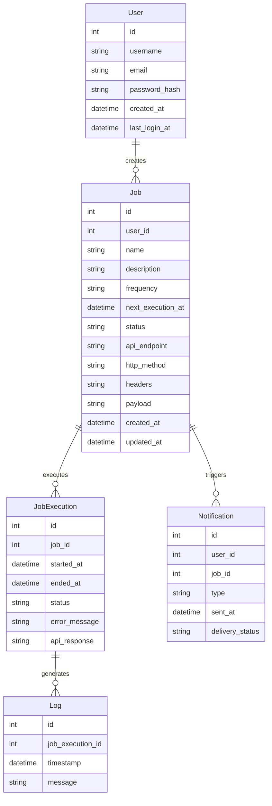
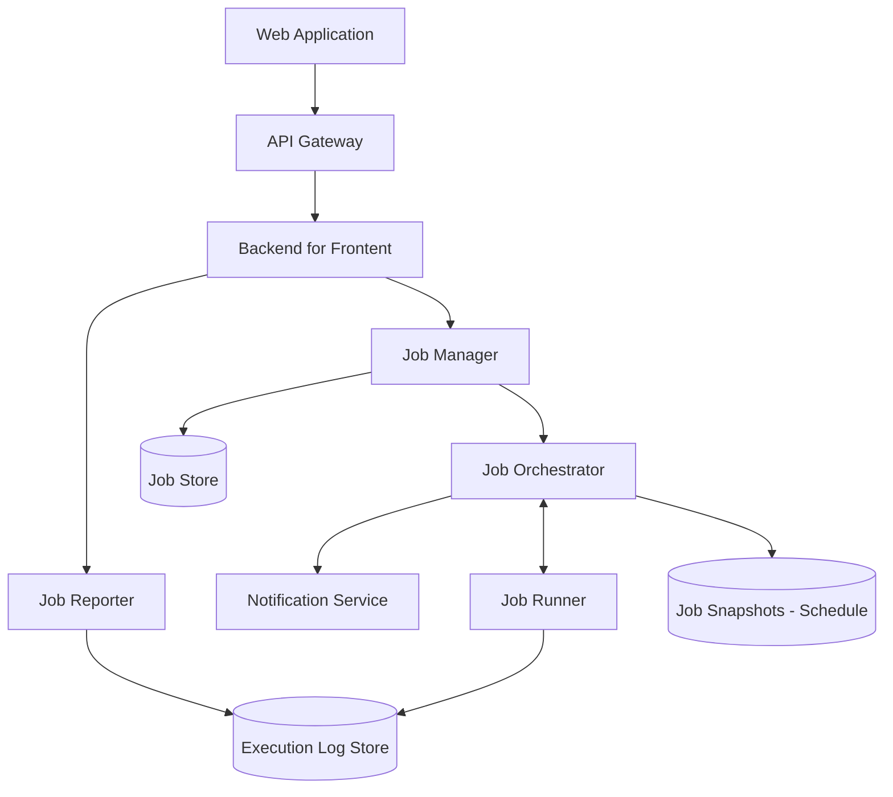
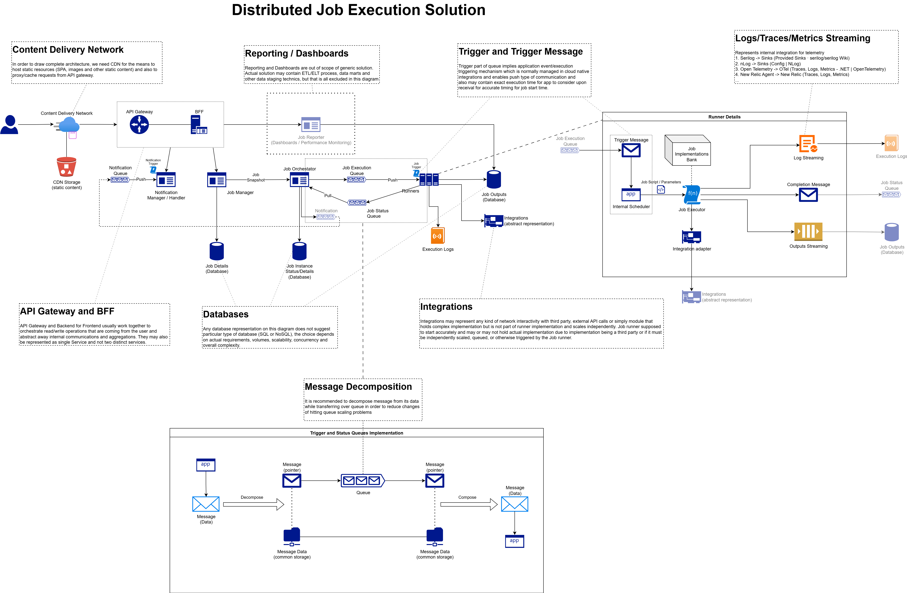

### Online Job Scheduler Domain Overview

During this course, we will cover the practical implementation of an **Online Job Scheduler** application. Online Job Scheduler systems operate within the task automation and scheduling domain, focusing on managing, executing, and monitoring scheduled jobs. These platforms allow users to create, edit, delete, and test jobs, as well as view logs and receive notifications for job failures. The system ensures efficient task execution and provides insights into job performance.

The primary purpose of the scheduler is to automate repetitive tasks, such as invoking APIs for data synchronization, triggering workflows, or performing system health checks, at specified times or intervals. This functionality is similar to a **cron job**, but with enhanced features like real-time monitoring, failure notifications, and detailed execution logs.

> **Disclaimer**: The description of the Data Model and requirements provided here is neither full nor final. The purpose of the description below is to facilitate an understanding of the domain, potential use cases, and to present one possible implementation option for reference. The described diagrams are primarily intended to provide necessary domain background. You suppose to adjust these in subsequent modules when you implement them.

---

### 1. Technical Requirements of Online Job Scheduler Systems

1. **Scalability**: Handle thousands of concurrent jobs and users, ensuring efficient execution and monitoring.
2. **Reliability**: Ensure jobs are executed on time, even during peak loads or partial outages.
3. **Real-time Monitoring**: Provide real-time updates on job execution status and logs.
4. **Failure Notifications**: Notify users immediately in case of job failures or errors.
5. **Flexibility**: Support one-time jobs, recurring jobs, concurrent and singleton jobs, and test runs.
6. **Integration**: Enable jobs to execute arbitrarily complex implementation via implementations bank.
7. **Security**: Ensure all data flows between applications are protected at transit and at rest (when required).
8. **Cost Efficiency**: Balance infrastructure costs while maintaining adequate performance.

---

### 2. Online Job Scheduler Domain Entities

1. **User**  
   The User entity represents individuals who use the scheduler platform. It stores essential information about each user, including their unique identifier, username, email address, and password (stored securely as a PBKDF2 or Argon2 hash). It also includes timestamps for account creation and last login.

2. **Job**  
   The Job entity represents tasks scheduled by users. Each job has a unique identifier, a name, a description, and is associated with the user who created it. It includes details such as execution frequency (one-time or recurring), execution time, status (active/inactive), and whether or not it is allowed to run concurrently with itself (singleton/concurrent). Additionally, it stores all required information and parameters to execute the job. Job implementations are extendable (see Job Implementation Bank component) and can represent any type of integration: API call, Database query, end to end complex implementation.

3. **JobExecution**  
   The JobExecution entity represents individual instances of a job being executed. It stores information about the job, execution start and end times, status (success/failure), and any error messages encountered during execution. 

4. **Notification**  
   The Notification entity represents alerts sent to users regarding job failures or other critical events. Each notification has a unique identifier, is associated with a user and a job, and includes details such as the notification type, timestamp, and delivery status.

5. **Log**  
   The Log entity represents detailed records of job executions. It stores information about the job, execution instance, timestamps, and any output or error messages generated during execution. Logs are crucial for debugging and performance analysis.

---

### 3. Online Job Scheduler Domain Entities

#### Field types are indicative and may not reflect actual database types.

---

### 4. Conceptual Component Diagram

### 5. Conceptual Solution Components Diagram

---

### 6. Use Cases

#### 1. **Job Management**
1. **UC1.1: Create a New Job**
   - **Description:** Allows users to create a new job, specifying details such as name, frequency, execution time, and concurrency
   - **Input:** UserId, JobDetails (Name, Frequency, ExecutionTime, Job Parameters)
   - **Output:** Success/Failure

2. **UC1.2: Edit Existing Job**
   - **Description:** Enables users to modify the details of an existing job, including Job parameters.
   - **Input:** UserId, JobId, UpdatedJobDetails
   - **Output:** Success/Failure

3. **UC1.3: Delete Existing Job**
   - **Description:** Allows users to delete a job from the scheduler.
   - **Input:** UserId, JobId
   - **Output:** Success/Failure

#### 2. **Job Execution**
1. **UC2.1: Execute a Job At a Scheduled Time**
   - **Description:** Starts job execution at a specified time.
   - **Input:** JobId, DateTimeUtc
   - **Output:** ExecutionStatus, Logs
  
2. **UC2.2: Execute a Job Immediately (Test Run)**
   - **Description:** Executes a job immediately.
   - **Input:** JobId
   - **Output:** ExecutionStatus, Logs

3. **UC2.3: View Job Execution History**
   - **Description:** Retrieves the execution history of a specific job.
   - **Input:** UserId, JobId, PaginationParams
   - **Output:** List of JobExecutions

#### 3. **Notifications**
1. **UC3.1: Configure Notifications for Job Failures**
   - **Description:** Allows users to set up notifications for job failures or errors.
   - **Input:** UserId, JobId, NotificationPreferences
   - **Output:** Success/Failure

2. **UC3.2: Send Notification for Job Failure**
   - **Description:** Sends a notification to the user when a job fails.
   - **Input:** UserId, JobId, FailureDetails
   - **Output:** NotificationStatus

#### 4. **Logs and Analytics**
1. **UC4.1: View Logs for a Job Execution**
   - **Description:** Retrieves detailed logs for a specific job execution instance
   - **Input:** UserId, JobExecutionId
   - **Output:** List of Logs

2. **UC4.2: Analyze Job Performance**
   - **Description:** Provides insights into job execution trends and performance metrics.
   - **Input:** UserId, JobId, AnalysisCriteria
   - **Output:** PerformanceMetrics

#### 5. UC1.1 Visualization (Create a New Job)

1. [Conceptual Sequence Diagram](./diagrams/uc-1.1/sequence.md)
2. [Conceptual Activity Diagram](./diagrams/uc-1.1/activity.md)

#### 6. UC2.1 Visualization (Execute a Job At a Scheduled Time)

1. [Conceptual Sequence Diagram](./diagrams/uc-2.1/sequence.md)
