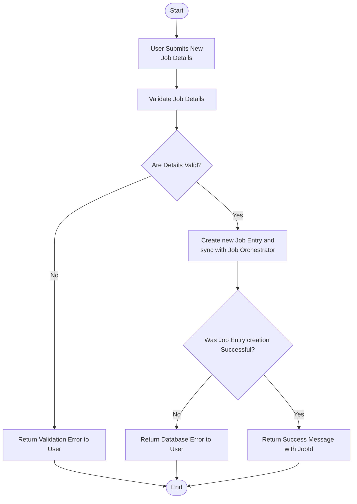

### Conceptual Activity Diagram for UC1.1

```mermaid
flowchart TD
    %% Start of the process
    Start([Start]) --> A[User Submits New <br/> Job Details]

    %% Validation process
    A --> B[Validate Job Details]
    B --> C{Are Details Valid?}
    C -->|No| D[Return Validation Error to User]
    D --> End([End])

    %% If valid, proceed to store in database
    C -->|Yes| E[Create new Job Entry and<br/>sync with Job Orchestrator]
    E --> F{Was Job Entry creation Successful?}
    F -->|No| G[Return Database Error to User]
    G --> End

    %% If successful, confirm job creation
    F -->|Yes| H[Return Success Message with JobId]
    H --> End
```