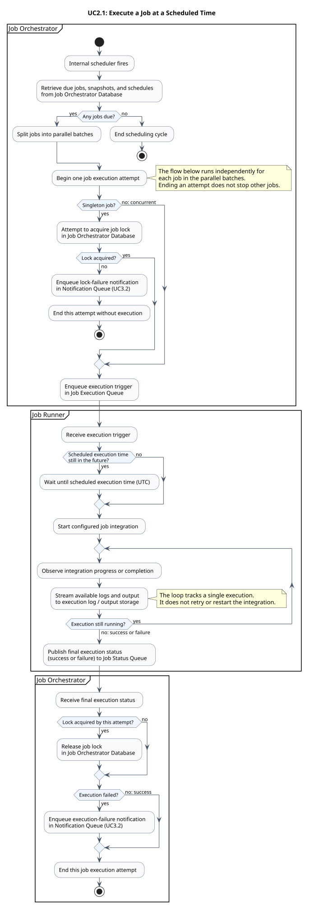

### Conceptual Activity Diagram for UC2.1

Execute a job at a scheduled time, following the [conceptual sequence diagram](./sequence.md). The orchestrator retrieves due jobs and splits them into parallel batches; the execution flow shown afterward applies independently to each job.



[Editable PlantUML source](./activity.puml)

#### Assumptions

- Singleton jobs require a lock. Following the reference sequence diagram, any lock-acquisition failure ends that attempt and enqueues a failure notification. Concurrent jobs bypass locking.
- The runner starts the configured integration once. Its progress loop streams logs and output until success or failure; it is not a retry loop.
- An acquired lock is released after either execution outcome. Only failures enqueue notification requests; delivery is covered separately by UC3.2.
- Queue transport and storage operations, including lock release, are assumed to succeed. Retries, duplicate delivery, lock expiry, infrastructure recovery, and recurrence advancement are outside this conceptual diagram.

#### Regenerate the preview

Run from the repository root with PlantUML installed:

```sh
plantuml --check-syntax 02_practical_cases_domain_intro/diagrams/uc-2.1/activity.puml
plantuml --svg 02_practical_cases_domain_intro/diagrams/uc-2.1/activity.puml
```
