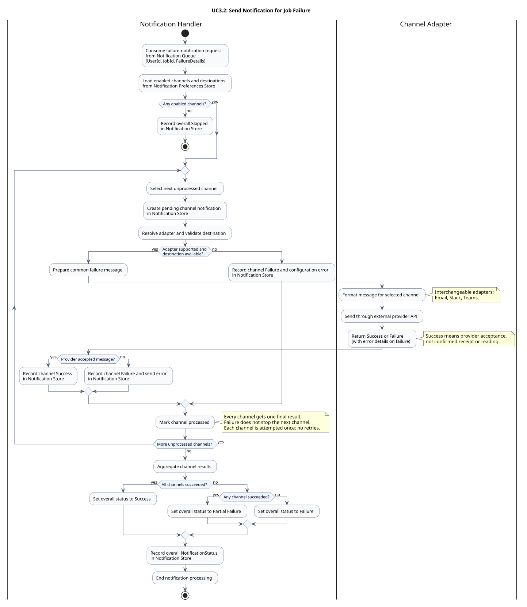

### Conceptual Activity Diagram for UC3.2

Send notifications for a job failure using the same flow and outcome rules as the [UC3.2 sequence diagram](./sequence.md). The Notification Handler consumes a queued request, loads preferences configured through UC3.1, and processes each enabled channel once.



[Editable PlantUML source](./activity.puml)

#### Channel processing and outcomes

The Notification Handler selects the adapter and prepares the common failure message. The Channel Adapter formats that message and sends it through the selected external provider. Email, Slack, and Teams are interchangeable adapter implementations.

Missing destinations, unsupported adapters, and send failures each produce a channel Failure with error details. All result branches merge before selecting another channel, so one failure never prevents the remaining attempts. Marking a channel processed represents progress through this request's channel list, not a separate database write.

| Overall NotificationStatus | Meaning |
| --- | --- |
| Skipped | No channels are enabled; no channel notifications are created. |
| Success | All enabled channel attempts succeed. |
| Partial Failure | At least one attempt succeeds and at least one fails. |
| Failure | All enabled channel attempts fail. |

#### Assumptions

- The queued request contains `UserId`, `JobId`, and `FailureDetails`; preferences and destinations are loaded from Notification Preferences Store.
- Each enabled channel gets a pending record followed by exactly one final Success or Failure result in Notification Store. Attempts are sequential and are not retried.
- Success means provider acceptance, not confirmed receipt or reading by the user.
- Queue and store operations succeed. Retries, duplicate handling, provider callbacks, parallel delivery, and infrastructure recovery are outside this conceptual diagram.
- Stores describe conceptual responsibilities, not a required database topology. Outcome labels do not introduce application API or schema changes.

#### Regenerate the preview

Run from the repository root with PlantUML installed:

```sh
plantuml --check-syntax 02_practical_cases_domain_intro/diagrams/uc-3.2/activity.puml
plantuml --svg 02_practical_cases_domain_intro/diagrams/uc-3.2/activity.puml
```
