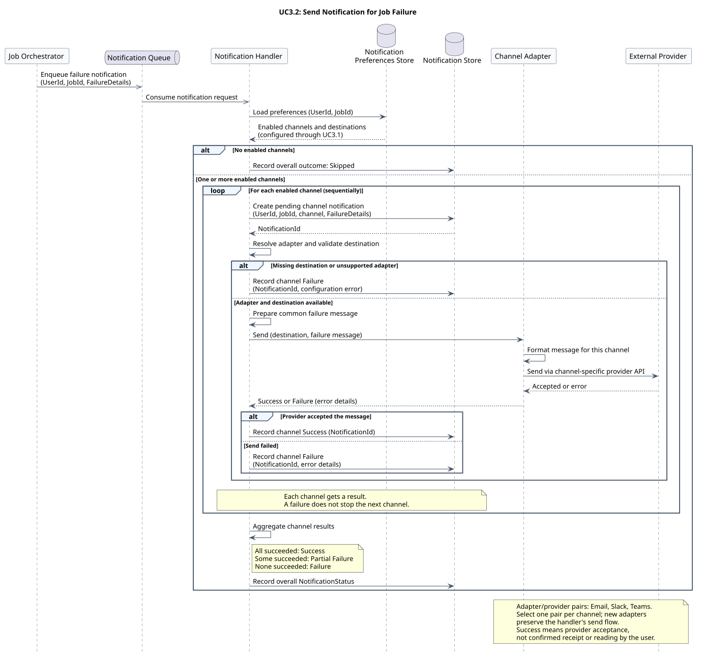

### Conceptual Sequence Diagram for UC3.2

Send notifications for a job failure, continuing from the notification queue in the [UC2.1 activity diagram](../uc-2.1/activity.md). The Notification Handler loads preferences configured through UC3.1 and attempts every enabled channel independently.



[Editable PlantUML source](./sequence.puml)

#### Channel extensibility and outcomes

The generic Channel Adapter and External Provider lifelines represent the pair selected for the current channel, such as Email, Slack, or Teams. Adapters own channel-specific formatting and provider calls; adding a channel preserves the handler's send flow.

Each channel gets a pending notification record followed by a Success or Failure result. Missing destinations and unsupported adapters count as channel failures. A failed channel does not prevent attempts through the remaining channels.

| Overall NotificationStatus | Meaning |
| --- | --- |
| Skipped | No channels are enabled. |
| Success | All enabled channel attempts succeed. |
| Partial Failure | At least one attempt succeeds and at least one fails. |
| Failure | All enabled channel attempts fail. |

#### Assumptions

- The request contains `UserId`, `JobId`, and `FailureDetails`. Preferences and destinations have already been configured through UC3.1.
- Success means the provider accepted the message; it does not confirm receipt or reading by the user.
- Attempts run sequentially in this diagram. Each failed attempt records error details without retries.
- Queue and store operations succeed. Retries, duplicate handling, provider callbacks, parallel delivery, and infrastructure recovery are outside this conceptual diagram.
- The two stores describe responsibilities, not a required database topology. Message names, per-channel results, and the stored overall status are conceptual; this diagram does not change application APIs or schemas.

#### Regenerate the preview

Run from the repository root with PlantUML installed:

```sh
plantuml --check-syntax 02_practical_cases_domain_intro/diagrams/uc-3.2/sequence.puml
plantuml --svg 02_practical_cases_domain_intro/diagrams/uc-3.2/sequence.puml
```
