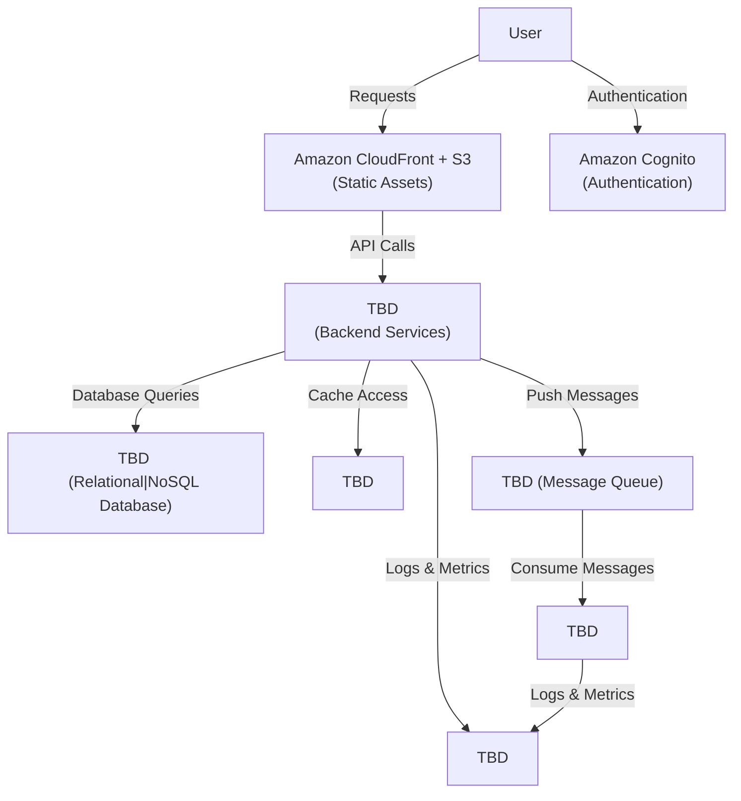

### Home Task: Solution Design and Scalability Analysis

#### Task Overview:
The goal of this task is to create an infrastructure diagram based on the provided conceptual solution components diagram, describe communication patterns, provide reasoning for design choices, and outline scalability options for each layer of the solution as it was requested in [NFRs for the solution](./../02_practical_cases_domain_intro/01-self-study-materials.md).

---

### Steps to Complete the Task:

#### 1. **Create Infrastructure Diagram for Solution**
   - Use the [conceptual solution components diagram](./../02_practical_cases_domain_intro/diagrams/solution-component-diagram.png) (from module 2) as a starting point.
   - Specify concrete instances for databases, services, queues, and other elements.
   - The example below is just illustrates the possible output but doesn't limit you in a format.

#### Example Infrastructure Diagram:
- **Cloud Provider:** Choose AWS or Azure (e.g., AWS for this example).
- **Components:**
  - **Frontend:** Amazon CloudFront (CDN) + S3 for static assets.
  - **Database 1:** Amazon RDS (Relational Database Service) for structured data.
  - etc

#### Diagram Example:

---

#### 2. **Describe Communication Patterns Between Components**, use the following as an example:
   - **Frontend to Backend:** The frontend communicates with backend services via REST APIs or GraphQL endpoints exposed by ECS or Lambda. CloudFront serves static assets and routes API requests to backend services.
   - **Backend to Database:** Backend services interact with the RDS database using secure connections (e.g., SSL/TLS). Queries are optimized for performance.
   - etc

---

#### 3. **Provide Reasoning for Your Selection**, use the following as an example:
   - **CloudFront + S3:** Chosen for scalability, low latency, and cost-effectiveness in serving static assets globally.
   - **RDS:** Provides managed relational database services with automated backups and scaling options.
   - etc

---

#### 4. **Provide Notes About Scalability Options**, use the following as an example:
   - **Frontend (CloudFront + S3):**
     - CloudFront automatically scales to handle increased traffic.
     - S3 provides virtually unlimited storage and scales seamlessly.
   - **Backend Services (ECS or Lambda):**
     - ECS supports auto-scaling based on CPU/memory usage or request rates.
     - Lambda scales automatically based on the number of incoming events.
   - etc

---

#### Notes for Adjustments:
- If you identify better options for components or architecture, document the changes and provide reasoning for your mentor.
- Stick to the components of the chosen cloud provider (AWS or Azure) for consistency. 
- You may also consider cloud agnostic solutions by the agreement with your mentor

---

### Scoreboard Criteria:

1. **1-59:** Infrastructure diagram created.
2. **60-89:** Communication patterns between services described.
3. **90-100:** Reasoning and scalability notes provided clearly.

